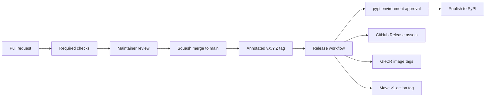

# Release process

This document describes how `docsmoke` releases are managed across PyPI,
GitHub Releases, GHCR, and the reusable GitHub Action.

The canonical distribution, import package, and CLI name are all `docsmoke`.
`doc-smoke` is a different normalized PyPI project name and is not a supported
alias.

## Version identifiers

`docsmoke` uses two related but different versioning surfaces:

- **Package release tags** such as `v1.0.4` are immutable release
  markers for the Python package, GitHub Release assets, SBOMs,
  signatures, and GHCR image tags.
- **Major action tags** such as `v1` are moving compatibility tags for
  the reusable GitHub Action. `v1` points to the latest compatible
  `1.x` release, not specifically to `v1.0.4`.

For example, after `v1.0.4` is released, both `v1.0.4` and `v1` point
to the same release commit. Users can choose:

```yaml
# Gets compatible bug fixes on the 1.x line automatically.
uses: fillbyte/docsmoke@v1

# Pins the exact action release for maximum reproducibility.
uses: fillbyte/docsmoke@v1.0.4
```

This follows GitHub's documented action-maintenance guidance: create
semantic version tags such as `v1.0.4` and keep major tags such as `v1`
current with the latest compatible release.

## Why `1`, `1.0`, `1.0.4`, `v1`, and `v1.0.4` all exist

The same release is named differently depending on where users consume
it:

| Surface | Example | Meaning |
| ------- | ------- | ------- |
| PyPI package | `1.0.4` | Exact Python package version installed by `pip` or `pipx`. |
| GitHub Release tag | `v1.0.4` | Exact release commit and assets. The `v` prefix is a Git tag convention. |
| GitHub Action tag | `v1` | Moving major tag for the latest compatible `1.x` action release. |
| GHCR image tag | `1.0.4` | Exact container image for one release. |
| GHCR image tag | `1.0` | Moving image tag for the latest compatible `1.0.x` patch. |
| GHCR image tag | `1` | Moving image tag for the latest compatible `1.x` image. |
| GHCR image tag | `latest` | Convenience image tag for the newest stable release. |

So `v1` does not mean "the original `v1.0.4` forever." It means "the
latest compatible release on the `1.x` line." After the next compatible
release, it is normal for `v1` to point at the same commit as that
newest exact tag.

## Channels

Each tagged release publishes four surfaces:

- **PyPI**: the canonical Python package installed by `pip`, `pipx`, or
  Python environments.
- **GitHub Releases**: wheel, sdist, CycloneDX SBOM, and Sigstore
  bundles.
- **GHCR**: container tags for `latest`, major, major/minor, and exact
  version, for example `latest`, `1`, `1.0`, and `1.0.4`.
- **GitHub Action**: the repository root `action.yml`, consumed through
  `uses: fillbyte/docsmoke@...`.

GitHub Packages may show the GHCR image after the first successful container
release. PyPI packages do not appear in GitHub's Packages panel because PyPI is
a separate registry.

## Release flow



## Required checks and approvals

Changes to `main` go through a pull request. The branch rules require:

- one approving review
- code owner review
- required status checks for Python 3.10, 3.11, 3.12, 3.13, 3.14,
  distribution build, and container image build
- linear history and squash merges

The `pypi` environment requires maintainer approval before the PyPI
publish job can proceed. This is intentional. GitHub Actions cannot
approve pull request reviews in this repository, and auto-merge is
disabled.

PyPI Trusted Publishing must authorize GitHub owner `fillbyte`, repository
`docsmoke`, workflow `release.yml`, and environment `pypi`. Any future change
to that owner, repository, workflow, or environment must also update the
external PyPI trust relationship.

## Release steps

1. Update `pyproject.toml` with the new version.
2. Add release notes to `CHANGELOG.md`.
3. Open a pull request and wait for CI, Pages, and CodeQL checks.
4. Merge with squash after review.
5. Create and push the exact release tag, replacing `vX.Y.Z` with the
   version being released:

   ```bash
   git tag -a vX.Y.Z -m "vX.Y.Z"
   git push origin vX.Y.Z
   ```

6. Approve the `pypi` environment deployment when the release workflow pauses.
7. Confirm the release workflow completed successfully.
8. Confirm PyPI, GitHub Release assets, GHCR tags, and the major action
   tag.

Publishing PyPI and GHCR is a prerequisite for creating the GitHub Release and
moving the major action tag. This prevents a failed registry publication from
advertising a partially released version through `v1`.

The release workflow updates the major action tag automatically:

```bash
git tag -fa v1 -m "Update v1 to vX.Y.Z" "$GITHUB_SHA"
git push origin refs/tags/v1 --force
```

Force-updating `v1` is expected because it is a moving compatibility
tag. Exact tags such as `v1.0.4` should only be moved to recover from a
failed release before users depend on it; normal releases should create
a new exact tag.

## Historical partial release: v1.0.1

The `v1.0.1` workflow published the Git tag and GHCR image, but its PyPI
Trusted Publishing step failed. Because PyPI publishing is a prerequisite for
the final release job, no `v1.0.1` GitHub Release or signed release assets were
created. The complete `v1.0.2` release superseded it.

This is preserved as release history, not repaired by publishing old artifacts
after the fact. Do not backfill `1.0.1` to PyPI or create a retrospective
GitHub Release. Consumers should use `1.0.2` or newer.

## Failure recovery

If the release workflow fails after an exact tag has been pushed:

1. Inspect the failing job logs.
2. Fix the release workflow or packaging issue on `main` through a pull
   request.
3. Re-point the exact tag only if the failed release did not complete
   successfully.
4. Re-run the tag-triggered workflow by pushing the corrected tag.
5. Delete or cancel failed historical runs when GitHub permissions allow
   it.

Never upload files manually to PyPI or GHCR unless automation is fully
blocked and the manual action is documented in `CHANGELOG.md`.

## Post-release checklist

- `gh release view vX.Y.Z` lists wheel, sdist, SBOM, and Sigstore JSON
  files.
- PyPI reports the new version.
- GHCR exposes `latest`, major, major/minor, and exact version tags.
- `git rev-parse v1^{commit}` matches `git rev-parse vX.Y.Z^{commit}`.
- `gh run list --limit 10` shows no current failed release run.
- The local tree is clean after `make clean`.
